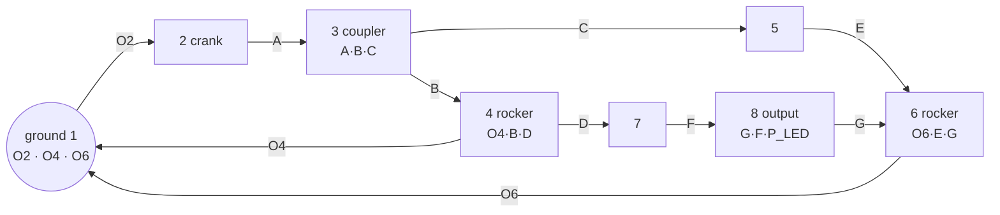

# KREAMET

A kinematic-synthesis workbench for **single-motor, cam-free, planar linkages** whose output LED
traces a chosen closed curve — by default an approximately 250 × 250 mm heart, on the 8-bar chain
the brief specifies. The mechanism size (4 to 14 bars), the target trajectory, and every design
limit are editable in the app. Vite + React + TypeScript + Three.js.

The interface is **bilingual — English and Turkish (Türkçe)** — switchable from the header at any
time. *Arayüz İngilizce ve Türkçe olarak iki dillidir; sağ üstteki EN / TR düğmesinden
değiştirilebilir.*

```bash
npm install
npm run dev        # http://localhost:5173
npm test           # 78 unit + integration tests
npm run smoke      # browser smoke test against a running dev server (31 checks)
npm run optimize   # offline synthesis run (writes src/synthesis/optimizedResult.json)
                   #   add --dyads N to search a different mechanism size
```

## Continuous integration

`.github/workflows/ci.yml` runs on every push to `main` and every pull request:

| Job | Does |
|---|---|
| **verify** | `npm ci` → `typecheck` → `test` (78) → `build`, and uploads `dist` as an artifact |
| **smoke** | installs Chromium, starts the dev server, runs the 31-check browser smoke test |

The smoke job runs against the **dev** server rather than the preview build on purpose: it drives
the app through the `window.__viewer` handle, which is deliberately stripped from production
bundles. It covers what unit tests cannot — crank dragging, screen↔world round-tripping, playback,
the debug overlay, canvas-edge clipping, changing the link count, selecting and editing a bar,
editing the target trajectory, changing a constraint, and the EN/TR switch. `SMOKE_SETTLE` raises the settle time
because CI runners are slower than a dev box, and `CHROMIUM` can point the script at a specific
browser binary; otherwise it falls back to whatever Playwright installed.

---

## A. Topology

Three fixed pivots, one input crank at `O2`, and **three RRR Assur dyads in series**. This is the
default; §J below describes how the same machinery covers 4 to 14 bars.

```
Link 1  GROUND     joints: O2, O4, O6
Link 2  CRANK      joints: O2, A                     <- the only driven body
Link 3  COUPLER    joints: A, B, C          (ternary)
Link 4  ROCKER     joints: O4, B, D         (ternary)
Link 5  BINARY     joints: C, E
Link 6  ROCKER-2   joints: O6, E, G         (ternary)
Link 7  BINARY     joints: D, F
Link 8  OUTPUT     joints: G, F   + P_LED (rigid point, not a joint)

Revolute pairs (10):
  O2(1-2)  A(2-3)  B(3-4)  O4(4-1)  C(3-5)
  E(5-6)   O6(6-1) D(4-7)  F(7-8)   G(8-6)
```



## B. Mobility (Grübler–Kutzbach)

All pairs are lower revolute pairs, so `j₂ = 0`:

```
M = 3(n − 1) − 2·j₁ − j₂ = 3(8 − 1) − 2(10) − 0 = 21 − 20 = 1     ✔
```

Incidence consistency: `3+2+3+3+2+3+2+2 = 20 = 2 × 10` ✔.
`topology.ts` re-derives this **from the graph it actually builds** — not from the formula — and
**throws** on a mis-drawn graph, so a topology error cannot reach the solver. The UI prints
`Mobility = 1` for whatever mechanism is loaded.

## C. Independent loops

`L = j − n + 1 = 10 − 8 + 1 = 3`

```
I    O2 -[L2]- A -[L3]- B -[L4]- O4 -[ground]- O2
II   O2 -[L2]- A -[L3]- C -[L5]- E -[L6]- O6 -[ground]- O2
III  O4 -[L4]- D -[L7]- F -[L8]- G -[L6]- O6 -[ground]- O4
```

## D. Design vector (15 continuous variables)

Fixed by the brief and **not** optimised: `O2 = (0,0)`, `|O2 O4| = 120`, `|O4 O6| = 120`,
crank `|O2 A| = 50`.

`phi6`, `lAB`, `c3r`, `c3a`, `lO4B`, `d4r`, `d4a`, `lCE`, `lO6E`, `g6r`, `g6a`, `lDF`, `lGF`,
`p8r`, `p8a`

Ternary bodies are parameterised by the (radius, angle) of their third point in the body's own
frame, so each body is rigid **by construction** rather than by constraint. The dependent sides
(`BC`, `BD`, `EG`, `FP`) follow from the law of cosines and are bound-checked too — every printed
member, including the LED extension, is held inside `[50, 200] mm`.

## E. Forward kinematics — closed form, zero iteration

```
A = O2 + 50·(cos θ, sin θ)
Dyad I    B = circle∩circle(A, |AB| ; O4, |O4B|)   →  link 3 pose → C ;  link 4 pose → D
Dyad II   E = circle∩circle(C, |CE| ; O6, |O6E|)   →  link 6 pose → G
Dyad III  F = circle∩circle(D, |DF| ; G,  |GF| )   →  link 8 pose → P_LED
```

No Newton iteration is used anywhere. Because of that, the loop-closure residual is a genuine
**independent** check rather than the solver's own stopping criterion — measured **1.3 × 10⁻¹³ mm**
against a 0.05 mm tolerance. Branch continuity is maintained by choosing, at every frame, the
circle-intersection root nearest the previous frame's solution; the first frame is fixed by an
explicit assembly selector.

## F. Variable mechanism size (4 – 14 bars)

The link count is a control in the app, not a rebuild. That is safe rather than adventurous because
of what the family is: **one crank plus N RRR Assur dyads solved in series**. An Assur group has
zero mobility by definition, so attaching one to an already-assembled chain cannot change the
degree of freedom. With N dyads,

```
n = 2 + 2N links        (ground + crank + two bars per dyad)
j = 1 + 3N joints       (O2 + three revolute pairs per dyad)
M = 3(n − 1) − 2j = 3(1 + 2N) − 2(1 + 3N) = 1          for every N
```

so every size on offer is 1-DOF *by construction*. The app still computes `M` from the graph it
builds and displays it, and a unit test checks the constructed graph — not the identity above — at
every offered size.

Each dyad is anchored at two points that are already known when it is solved (the crank tip, a
ground pivot, or a rigid attachment point carried by an earlier dyad's bar), so its unknown joint
still comes from a single circle–circle intersection. **The solver stays closed-form at any size**;
nothing iterative appears as the chain grows.

`mechanism/spec.ts` holds the whole family: which points each dyad hangs off, how many ground
pivots there are, which body carries the LED, and the resulting parameter layout. The layout order
was chosen so that **N = 3 reproduces the original 15-variable vector verbatim** — the optimised
designs shipped with the app are plain number arrays and must keep loading unchanged.

Changing size necessarily discards the current parameter vector, because it indexes a different
topology. Rather than leaving an unusable design on screen, the app draws a fresh starting point
from the constructive sampler and labels it `SAMPLED START`, so it is never confused with the
shipped `OPTIMIZED RESULT`.

## G. Editable target trajectory

The target is defined by a set of **control points**, which is what makes it editable and what
survives a round trip through export/import. Turn on *Edit points on canvas* and drag a handle to
move a point, shift-click empty space to add one, alt-click a handle to delete one. The dense
polyline the error is measured against is a closed centripetal Catmull-Rom (α = 0.5) through those
controls — centripetal rather than uniform because uniform Catmull-Rom overshoots and can form
cusps when points are unevenly spaced, which is exactly what hand-placed points look like.

**The built-in heart is the one exception, deliberately.** It resolves to its *analytic* samples,
not to a spline through its 64 control points. That distinction is not cosmetic: the spline sits
≈ 0.13 mm RMS off the true curve and rounds the bottom cusp, which measurably flatters the reported
trajectory error. Substituting it silently would change every number in the results table. The
controls exist so the heart can be picked up and edited; the moment one moves, the curve becomes
`custom` and the spline takes over — an explicit user action rather than a hidden approximation.

While editing, the target is drawn in **its own coordinates** so each handle sits exactly where the
drag puts it. With editing off, it is drawn after the best rigid alignment onto the LED path — the
placement the error is actually measured against. Drawing the aligned copy while editing would put
the handles somewhere the drag does not correspond to.

Import is deliberately permissive: our own export format, a `{points: […]}` wrapper, `[[x,y], …]`,
or `[{x,y}, …]`, so a curve can come from a spreadsheet or another tool. Unreadable entries are
skipped and *counted in the message*, rather than silently dropped.

## H. Clicking a bar or a joint

Clicking anything on the canvas selects it and fills the **Selection** panel; clicking a row in the
link table does the same. What the panel then offers depends on an honest distinction:

* a **bar's length** (and the radius/angle placing a rigid third point) is a design variable, so it
  is presented as a slider and editing it changes the mechanism immediately;
* a **moving joint's position** is *derived* — it is wherever the mechanism puts it at this motor
  angle. It is shown read-only, together with the design variables that do control it. Offering a
  coordinate box for a solved joint would imply a freedom that does not exist;
* the **crank length** and the frame spacings are constraints rather than design variables, so the
  panel links through to the limits instead of pretending to edit them in place.

The panel also reports the dependent member lengths that follow from the law of cosines, the number
of revolute pairs coincident at a point (several bodies can be pinned at one rigid point), and the
body's assembly layer.

## I. Editable constraints

`CONFIG` is a single source of truth that is **mutable at runtime**, so the constraints panel can
change link-length bounds, frame dimensions, bar width, the singularity rejection threshold, target
size and all seven objective weights without a rebuild. Every module already reads `CONFIG.x` at
call time, so a change takes effect on the next evaluation; the alternative — threading a settings
object through every solver signature — would touch the whole codebase to express the same thing.

The trade-off is global mutable state. It is acceptable here because the settings genuinely are
global to a session, each execution context (window, Web Worker, offline script) owns its own module
instance, and everything is single-threaded, so no evaluation observes a half-applied change. A
frozen copy of the shipped defaults makes *Restore defaults* exact, and a test asserts the round
trip.

Because the worker is a separate module instance, the spec, the target curve **and** a snapshot of
the constraints are all sent with each optimisation request — otherwise the search would silently
optimise against the shipped defaults while the UI displayed something else.

---

## Two results that came out of the analysis, not out of the brief

Both are recorded here because they changed the design, and neither is an implementation
shortcut.

### 1. The input dyad cannot exceed a 44.75° transmission angle

The 50 mm crank forces `|A O4|` to sweep the full band `[120−50, 120+50] = [70, 170] mm` on every
revolution. For an RRR dyad, `cos μ = (r₀² + r₁² − d²) / (2 r₀ r₁)`, so holding `μ ≥ μ_min` across
that whole band requires simultaneously

```
4·r₀r₁·cos μ ≥ d²max − d²min = 24000        and        2·r₀r₁·(1 − cos μ) ≤ d²min = 4900
```

Eliminating `r₀r₁` gives `cos μ ≥ 6000/8450`, i.e. **μ_max = 44.75°**, attained at
`lAB = lO4B = 91.9 mm`. So the brief's 60–120° "optimum band" (§18) is unreachable for dyad I with
the mandated 120 mm frame and 50 mm crank — the 40–140° hard limit is reachable, but only in a
narrow band of link lengths. The optimiser's singularity term is therefore referenced to 45°, not
60°, so that it is zero at the physical optimum and still carries a gradient. The shipped
mechanisms sit at **μ_eff ≈ 44.7°**, essentially on that ceiling. Widening `O2O4` or lengthening
the crank is the only way past it.

### 2. A strictly coplanar 8-bar of this family is not buildable at 12 mm bar width

Over 454 randomly generated *valid* mechanisms of this topology (full rotation, all members in
range), **zero** were free of coplanar interference. With three closed loops and fifteen 12 mm
bars in one plane, members inevitably sweep across one another. Treating any crossing as fatal
(§43) would reject every mechanism, including sound ones.

Real multi-loop linkages — and 3D-printed ones in particular — are built in **stacked parallel
planes**. So `collision/layering.ts` keeps the strict coplanar check as a reported metric (§19,
shown live and drawn in red) and additionally computes the interference graph over the cycle,
colours it (Welsh–Powell), and reports what actually constrains manufacture: **how many layers the
stack needs** and **how far a pin must span**. That is what the objective penalises. Every shipped
mechanism needs only **2 layers**.

---

## Results

### INITIAL GUESS

The starting geometry, from the constructive sampler with RNG seed 1 — reproduce with
`npx tsx scripts/genInitial.ts`. It is deliberately *not* good:

| | |
|---|---:|
| Full rotation | 720 / 720 |
| Assembly jumps | 0 |
| Max loop closure | 1.14 × 10⁻¹³ mm |
| Path closure | 1.4 × 10⁻¹⁴ mm |
| Effective μ | 42.47° |
| Assembly layers | 2 |
| LED bounding box | **77.8 × 47.6 mm** |
| Chamfer RMS | **69.82 mm** |
| Objective `J` | 7.7997 |

### OPTIMIZED RESULT

Produced by `npm run optimize` (7 independent runs, ~9500 evaluations each, merged by
`scripts/merge.ts`). Nothing below is hand-authored; `npm test` re-evaluates the stored
solutions and asserts they reproduce their recorded metrics. When a scoring definition changes,
`npx tsx scripts/refreshMetrics.ts` re-measures the stored designs with the current engine and
rewrites the file — the design vectors are never touched, only the numbers describing them, and the
provenance of the original runs is carried through unchanged.

Best of 20 retained mechanisms:

| Metric | Value | Target |
|---|---:|---:|
| Objective `J` | 1.1807 | — |
| Chamfer RMS | **11.41 mm** | < 10 mm (§62 "good") |
| Max error | 21.0 mm | — |
| LED bounding box | **240.0 × 249.2 mm** | 250 × 250 mm |
| Heart match (display score) | 75.2 % | — |
| Frames solved | **720 / 720** | 720/720 |
| Assembly jumps | **0** | 0 |
| Max loop closure error | 1.3 × 10⁻¹³ mm | < 0.05 mm |
| Path closure ‖P(0) − P(2π)‖ | 0.0 mm | < 0.1 mm |
| Effective transmission angle | **44.70°** | > 40° (ceiling is 44.75°) |
| Singularity margin σ_min(∂F/∂q) | 0.228 | — |
| Assembly layers | 2 | — |
| Peak gravity torque | 0.236 N·m | — |

**Where this lands against §62.** The mandatory criteria are all met: mobility 1, full rotation
PASS, 0 invalid frames, 0 assembly jumps, and a bounding box within ~4 % of 250 × 250 mm. The
trajectory RMS of 11.41 mm is **just above** the < 10 mm "good" threshold and well short of the
2.5 mm "very good" one. That is an honest limit of this search, not a claim of optimality — 20
distinct mechanisms cluster in 11.4–12.6 mm, which suggests the topology and the 50–200 mm bounds,
rather than the optimiser, are the binding constraint. The obvious next levers are relaxing the
crank length, admitting a fourth ground pivot, or a much longer global search. Per §59, no solution
was accepted that bought lower RMS with a singular or non-assemblable configuration.

---

## Architecture

Solver, dynamics and synthesis are framework-independent TypeScript; React only drives them.
The Web Worker imports the *same* modules, so in-app and offline results are identical.

```
src/
  mechanism/   spec (the 4–14 bar family, parameter layout) · topology (graph + mobility check) ·
               mechanism (resolved geometry) · types · config (runtime-editable limits & weights)
  kinematics/  forwardSolver (dyadic, closed form at any size) · loopClosure · branchTracker ·
               jacobian (σ_min)
  synthesis/   heartCurve · targetCurve (editable target, import/export) ·
               curveMatching (Procrustes + Chamfer) · nearest · objective ·
               seeding (constructive sampler) · optimizer (DE + Nelder–Mead)
  dynamics/    massProperties · gravity · velocity · torque (Lagrange)
  collision/   segmentDistance · collisionDetector · layering
  rendering/   Scene · MechanismViewer (picking) · Link/Joint/Trail/Target/Debug renderers
  interaction/ crankDrag (CanvasController: target handles · crank · select · pan)
  workers/     optimization.worker
  i18n/        translations (en + tr, key-parity enforced by the type system) · provider
  ui/          ControlPanel · MetricsPanel · LinkTable · DesignPanels (mechanism size, constraints,
               target editor, selection inspector) · TorqueChart · LanguageSwitch · primitives
  utils/       math · units
scripts/       optimize (--dyads N) · merge · refreshMetrics · genInitial · findSeed · smoke
```

**Units.** Geometry, UI and rendering are in millimetres; all dynamics are strict SI. Every
crossing goes through `utils/units.ts`.

**Curve matching.** The target is rigidly aligned to the LED path — rotation and translation only,
never scale, since 250 × 250 mm is a physical requirement. The optimal (shift, direction, rotation,
translation) is found exactly by circular cross-correlation, not by iteration. Error is a
symmetric Chamfer distance measured point-to-*segment* against a spatial index, so a mechanism that
traces only part of the heart cannot score well.

**Objective.** `J = w₁E_curve + w₂E_size + w₃E_closure + w₄E_sing + w₅E_build + w₆E_ratio + w₇E_grav`
with the brief's weights in `config.ts`. Each term is normalised to a comparable scale first — with
raw values the millimetre-scaled curve term outweighs every physical constraint by two orders of
magnitude, and the optimiser happily returns mechanisms that trace a fine heart at 1° transmission
angle. The normalisation constants are in `CONFIG.scales`, documented with the reasoning.

## Localisation

`src/i18n/translations.ts` holds both dictionaries. `en` is the reference; `tr` is typed as
`Record<keyof typeof en, string>`, so **adding a string to one language and forgetting the other
fails the build** rather than silently shipping an English label in a Turkish UI. A test also
asserts that both languages share the same `{placeholder}` set, since a mistyped slot would render
a literal brace to the user.

Engineering notation (mm, N·m, θ, μ, σ, RMS, J, link and joint names) is deliberately **not**
translated — it is standard across both languages and a Turkish mechanism engineer expects it
unchanged. Only prose and labels are localised.

The initial language follows an earlier explicit choice, else the browser's `navigator.language`,
else English; the choice is stored in `localStorage` and also applied to `<html lang>`.

## Export

**Export JSON** emits pivot coordinates, every printed member length, the assembly layer of each
body, the full design vector, and the measured metrics — the handoff for CAD/STL generation. It is
deliberately self-contained: the mechanism spec, the constraint settings and the target curve all
travel with the geometry, because a parameter vector is meaningless without the topology it indexes
and the limits it was produced under.

**Export Target** writes just the trajectory (`kreamet-target/1`), so a curve can be moved between
designs or authored elsewhere.
