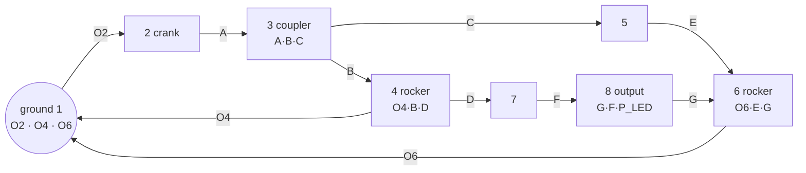

# KREAMET

A kinematic-synthesis workbench for a **single-motor, cam-free, planar 8-bar linkage** whose
output LED traces an approximately 250 × 250 mm heart. Vite + React + TypeScript + Three.js.

The interface is **bilingual — English and Turkish (Türkçe)** — switchable from the header at any
time. *Arayüz İngilizce ve Türkçe olarak iki dillidir; sağ üstteki EN / TR düğmesinden
değiştirilebilir.*

```bash
npm install
npm run dev        # http://localhost:5173
npm test           # 64 unit + integration tests
npm run smoke      # browser smoke test against a running dev server (18 checks)
npm run optimize   # offline synthesis run (writes src/synthesis/optimizedResult.json)
```

## Continuous integration

`.github/workflows/ci.yml` runs on every push to `main` and every pull request:

| Job | Does |
|---|---|
| **verify** | `npm ci` → `typecheck` → `test` (64) → `build`, and uploads `dist` as an artifact |
| **smoke** | installs Chromium, starts the dev server, runs the 18-check browser smoke test |

The smoke job runs against the **dev** server rather than the preview build on purpose: it drives
the app through the `window.__viewer` handle, which is deliberately stripped from production
bundles. It covers what unit tests cannot — crank dragging, screen↔world round-tripping, playback,
the debug overlay, canvas-edge clipping and the EN/TR switch. `SMOKE_SETTLE` raises the settle time
because CI runners are slower than a dev box, and `CHROMIUM` can point the script at a specific
browser binary; otherwise it falls back to whatever Playwright installed.

---

## A. Topology

Three fixed pivots, one input crank at `O2`, and **three RRR Assur dyads in series**.

```
Link 1  GROUND     joints: O2, O4, O6
Link 2  CRANK      joints: O2, A                     <- the only driven body
Link 3  COUPLER    joints: A, B, C          (ternary)
Link 4  ROCKER     joints: O4, B, D         (ternary)
Link 5  BINARY     joints: C, E
Link 6  ROCKER-2   joints: O6, E, G         (ternary)
Link 7  BINARY     joints: D, F
Link 8  OUTPUT     joints: G, F   + P_LED (rigid point, not a joint)

Revolute pairs (10):
  O2(1-2)  A(2-3)  B(3-4)  O4(4-1)  C(3-5)
  E(5-6)   O6(6-1) D(4-7)  F(7-8)   G(8-6)
```



## B. Mobility (Grübler–Kutzbach)

All pairs are lower revolute pairs, so `j₂ = 0`:

```
M = 3(n − 1) − 2·j₁ − j₂ = 3(8 − 1) − 2(10) − 0 = 21 − 20 = 1     ✔
```

Incidence consistency: `3+2+3+3+2+3+2+2 = 20 = 2 × 10` ✔.
`topology.ts` re-derives this at import time and **throws** on a mis-drawn graph, so a topology
error cannot reach the solver. The UI prints `Mobility = 1`.

## C. Independent loops

`L = j − n + 1 = 10 − 8 + 1 = 3`

```
I    O2 -[L2]- A -[L3]- B -[L4]- O4 -[ground]- O2
II   O2 -[L2]- A -[L3]- C -[L5]- E -[L6]- O6 -[ground]- O2
III  O4 -[L4]- D -[L7]- F -[L8]- G -[L6]- O6 -[ground]- O4
```

## D. Design vector (15 continuous variables)

Fixed by the brief and **not** optimised: `O2 = (0,0)`, `|O2 O4| = 120`, `|O4 O6| = 120`,
crank `|O2 A| = 50`.

`phi6`, `lAB`, `c3r`, `c3a`, `lO4B`, `d4r`, `d4a`, `lCE`, `lO6E`, `g6r`, `g6a`, `lDF`, `lGF`,
`p8r`, `p8a`

Ternary bodies are parameterised by the (radius, angle) of their third point in the body's own
frame, so each body is rigid **by construction** rather than by constraint. The dependent sides
(`BC`, `BD`, `EG`, `FP`) follow from the law of cosines and are bound-checked too — every printed
member, including the LED extension, is held inside `[50, 200] mm`.

## E. Forward kinematics — closed form, zero iteration

```
A = O2 + 50·(cos θ, sin θ)
Dyad I    B = circle∩circle(A, |AB| ; O4, |O4B|)   →  link 3 pose → C ;  link 4 pose → D
Dyad II   E = circle∩circle(C, |CE| ; O6, |O6E|)   →  link 6 pose → G
Dyad III  F = circle∩circle(D, |DF| ; G,  |GF| )   →  link 8 pose → P_LED
```

No Newton iteration is used anywhere. Because of that, the loop-closure residual is a genuine
**independent** check rather than the solver's own stopping criterion — measured **1.3 × 10⁻¹³ mm**
against a 0.05 mm tolerance. Branch continuity is maintained by choosing, at every frame, the
circle-intersection root nearest the previous frame's solution; the first frame is fixed by an
explicit assembly selector.

---

## Two results that came out of the analysis, not out of the brief

Both are recorded here because they changed the design, and neither is an implementation
shortcut.

### 1. The input dyad cannot exceed a 44.75° transmission angle

The 50 mm crank forces `|A O4|` to sweep the full band `[120−50, 120+50] = [70, 170] mm` on every
revolution. For an RRR dyad, `cos μ = (r₀² + r₁² − d²) / (2 r₀ r₁)`, so holding `μ ≥ μ_min` across
that whole band requires simultaneously

```
4·r₀r₁·cos μ ≥ d²max − d²min = 24000        and        2·r₀r₁·(1 − cos μ) ≤ d²min = 4900
```

Eliminating `r₀r₁` gives `cos μ ≥ 6000/8450`, i.e. **μ_max = 44.75°**, attained at
`lAB = lO4B = 91.9 mm`. So the brief's 60–120° "optimum band" (§18) is unreachable for dyad I with
the mandated 120 mm frame and 50 mm crank — the 40–140° hard limit is reachable, but only in a
narrow band of link lengths. The optimiser's singularity term is therefore referenced to 45°, not
60°, so that it is zero at the physical optimum and still carries a gradient. The shipped
mechanisms sit at **μ_eff ≈ 44.7°**, essentially on that ceiling. Widening `O2O4` or lengthening
the crank is the only way past it.

### 2. A strictly coplanar 8-bar of this family is not buildable at 12 mm bar width

Over 454 randomly generated *valid* mechanisms of this topology (full rotation, all members in
range), **zero** were free of coplanar interference. With three closed loops and fifteen 12 mm
bars in one plane, members inevitably sweep across one another. Treating any crossing as fatal
(§43) would reject every mechanism, including sound ones.

Real multi-loop linkages — and 3D-printed ones in particular — are built in **stacked parallel
planes**. So `collision/layering.ts` keeps the strict coplanar check as a reported metric (§19,
shown live and drawn in red) and additionally computes the interference graph over the cycle,
colours it (Welsh–Powell), and reports what actually constrains manufacture: **how many layers the
stack needs** and **how far a pin must span**. That is what the objective penalises. Every shipped
mechanism needs only **2 layers**.

---

## Results

### INITIAL GUESS

The starting geometry, from the constructive sampler with RNG seed 1 — reproduce with
`npx tsx scripts/genInitial.ts`. It is deliberately *not* good:

| | |
|---|---:|
| Full rotation | 720 / 720 |
| Assembly jumps | 0 |
| Max loop closure | 1.14 × 10⁻¹³ mm |
| Path closure | 0.00 mm |
| Effective μ | 41.59° |
| Assembly layers | 2 |
| LED bounding box | **117.0 × 18.5 mm** |
| Chamfer RMS | **72.80 mm** |

### OPTIMIZED RESULT

Produced by `npm run optimize` (7 independent runs, ~9500 evaluations each, merged by
`scripts/merge.ts`). Nothing below is hand-authored; `npm test` re-evaluates the stored
solutions and asserts they reproduce their recorded metrics.

Best of 20 retained mechanisms:

| Metric | Value | Target |
|---|---:|---:|
| Objective `J` | 1.1813 | — |
| Chamfer RMS | **11.41 mm** | < 10 mm (§62 "good") |
| Max error | 21.0 mm | — |
| LED bounding box | **240.0 × 249.2 mm** | 250 × 250 mm |
| Heart match (display score) | 75.2 % | — |
| Frames solved | **720 / 720** | 720/720 |
| Assembly jumps | **0** | 0 |
| Max loop closure error | 1.3 × 10⁻¹³ mm | < 0.05 mm |
| Path closure ‖P(0) − P(2π)‖ | 0.0 mm | < 0.1 mm |
| Effective transmission angle | **44.70°** | > 40° (ceiling is 44.75°) |
| Singularity margin σ_min(∂F/∂q) | 0.228 | — |
| Assembly layers | 2 | — |
| Peak gravity torque | 0.236 N·m | — |

**Where this lands against §62.** The mandatory criteria are all met: mobility 1, full rotation
PASS, 0 invalid frames, 0 assembly jumps, and a bounding box within ~4 % of 250 × 250 mm. The
trajectory RMS of 11.41 mm is **just above** the < 10 mm "good" threshold and well short of the
2.5 mm "very good" one. That is an honest limit of this search, not a claim of optimality — 20
distinct mechanisms cluster in 11.4–12.6 mm, which suggests the topology and the 50–200 mm bounds,
rather than the optimiser, are the binding constraint. The obvious next levers are relaxing the
crank length, admitting a fourth ground pivot, or a much longer global search. Per §59, no solution
was accepted that bought lower RMS with a singular or non-assemblable configuration.

---

## Architecture

Solver, dynamics and synthesis are framework-independent TypeScript; React only drives them.
The Web Worker imports the *same* modules, so in-app and offline results are identical.

```
src/
  mechanism/   types · topology (mobility check) · mechanism (design vector) · config (all weights)
  kinematics/  forwardSolver (dyadic) · loopClosure · branchTracker · jacobian (σ_min)
  synthesis/   heartCurve · curveMatching (Procrustes + Chamfer) · nearest · objective ·
               seeding (constructive sampler) · optimizer (DE + Nelder–Mead)
  dynamics/    massProperties · gravity · velocity · torque (Lagrange)
  collision/   segmentDistance · collisionDetector · layering
  rendering/   Scene · MechanismViewer · Link/Joint/Trail/Heart/Debug renderers
  interaction/ crankDrag
  workers/     optimization.worker
  i18n/        translations (en + tr, key-parity enforced by the type system) · provider
  ui/          ControlPanel · MetricsPanel · LinkTable · TorqueChart · LanguageSwitch · primitives
  utils/       math · units
```

**Units.** Geometry, UI and rendering are in millimetres; all dynamics are strict SI. Every
crossing goes through `utils/units.ts`.

**Curve matching.** The target is rigidly aligned to the LED path — rotation and translation only,
never scale, since 250 × 250 mm is a physical requirement. The optimal (shift, direction, rotation,
translation) is found exactly by circular cross-correlation, not by iteration. Error is a
symmetric Chamfer distance measured point-to-*segment* against a spatial index, so a mechanism that
traces only part of the heart cannot score well.

**Objective.** `J = w₁E_curve + w₂E_size + w₃E_closure + w₄E_sing + w₅E_build + w₆E_ratio + w₇E_grav`
with the brief's weights in `config.ts`. Each term is normalised to a comparable scale first — with
raw values the millimetre-scaled curve term outweighs every physical constraint by two orders of
magnitude, and the optimiser happily returns mechanisms that trace a fine heart at 1° transmission
angle. The normalisation constants are in `CONFIG.scales`, documented with the reasoning.

## Localisation

`src/i18n/translations.ts` holds both dictionaries. `en` is the reference; `tr` is typed as
`Record<keyof typeof en, string>`, so **adding a string to one language and forgetting the other
fails the build** rather than silently shipping an English label in a Turkish UI. A test also
asserts that both languages share the same `{placeholder}` set, since a mistyped slot would render
a literal brace to the user.

Engineering notation (mm, N·m, θ, μ, σ, RMS, J, link and joint names) is deliberately **not**
translated — it is standard across both languages and a Turkish mechanism engineer expects it
unchanged. Only prose and labels are localised.

The initial language follows an earlier explicit choice, else the browser's `navigator.language`,
else English; the choice is stored in `localStorage` and also applied to `<html lang>`.

## Export

**Export JSON** emits pivot coordinates, every printed member length, the assembly layer of each
body, the full design vector, and the measured metrics — the handoff for CAD/STL generation.
